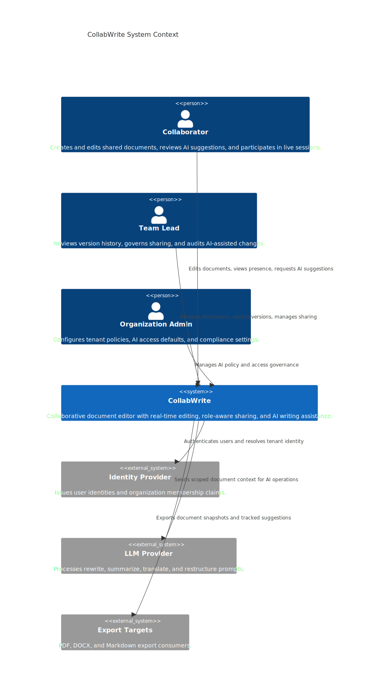
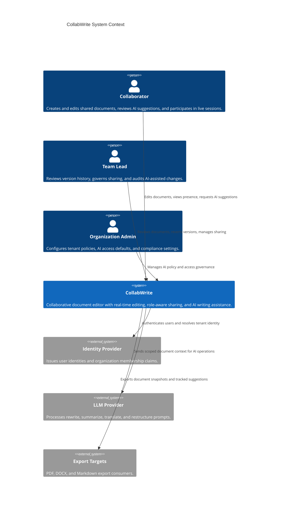
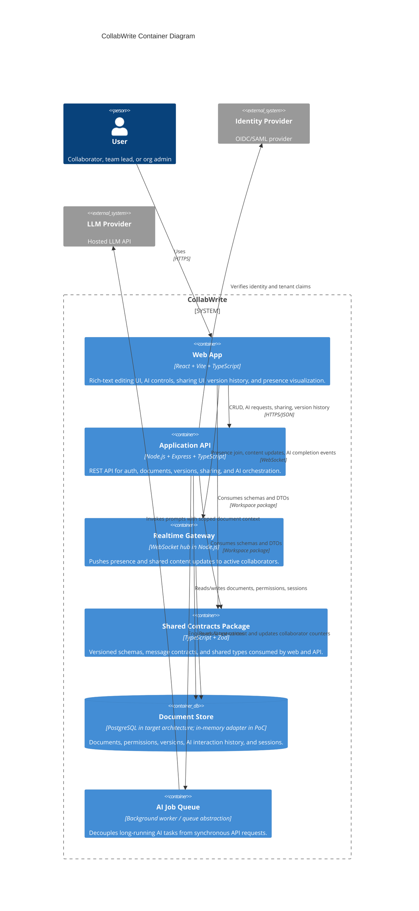
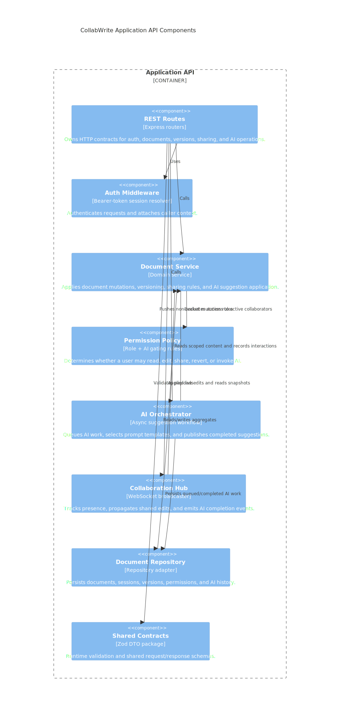
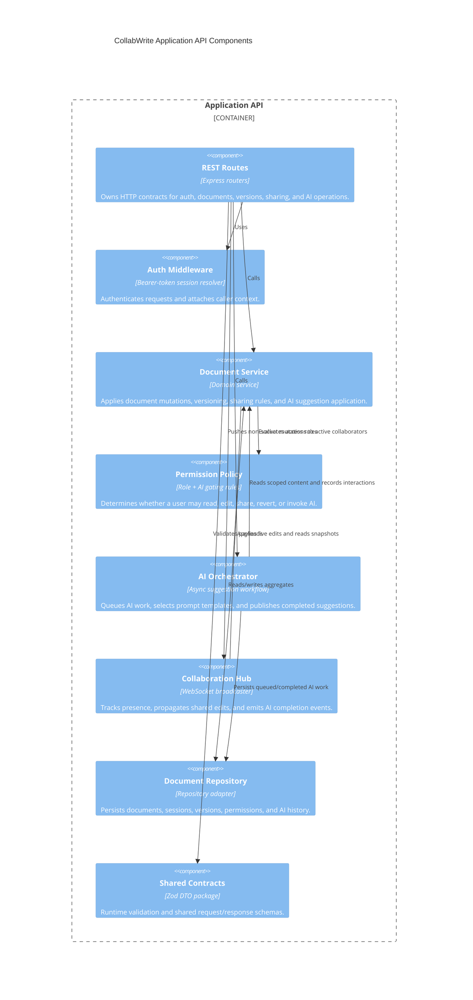
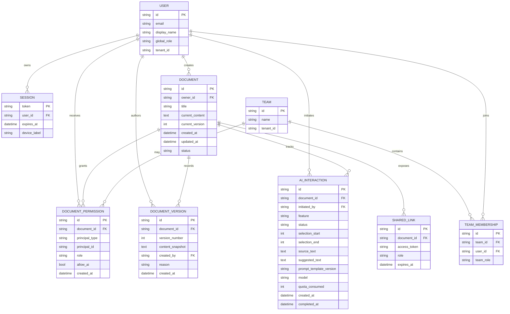

# Collaborative Document Editor with AI Writing Assistant
## Assignment 1: Requirements Engineering, Architecture, Project Management, and Proof of Concept

Prepared for the February 2026 midterm brief.  
Project codename: `CollabWrite`

## 1. Requirements Engineering

### 1.1 Stakeholder Analysis

| Stakeholder | Goals | Concerns | Influence on Requirements |
| --- | --- | --- | --- |
| Organization administrators | Enforce tenant policy, control AI access, manage compliance and retention | Data leakage to third-party LLMs, over-permissive sharing, lack of auditability | Drives role model, AI policy controls, session controls, and retention requirements |
| Team leads / document owners | Coordinate contributors, preserve quality, review changes, recover from mistakes | Unclear ownership, accidental overwrites, weak version history, no accountability for AI edits | Drives versioning, revert workflows, tracked AI interactions, and owner-only sharing controls |
| Security / compliance reviewers | Ensure sensitive content is protected at rest, in transit, and during AI processing | Prompt data exposure, insufficient encryption, uncontrolled logging, long retention windows | Drives security and privacy NFRs, AI data minimization, and retention policy design |
| AI operations / product managers | Deliver useful, predictable AI assistance within budget | Cost spikes, long response times, irrelevant context, model drift | Drives async AI orchestration, scoped context, quotas, prompt versioning, and graceful degradation |
| Developers / maintainers | Build features in parallel, keep contracts stable, test safely | Tight coupling between web and API, schema drift, merge conflicts across features | Drives monorepo choice, shared contract package, ADRs, module decomposition, and testing strategy |
| Customer support / success teams | Diagnose access issues and explain document history to customers | No reproducible audit trail, weak observability, unclear role behavior | Drives explicit error codes, AI interaction history, and clear sharing/role semantics |

### 1.2 Functional Requirements

#### Real-Time Collaboration

| ID | Level | Description | Trigger | Expected System Behavior | Acceptance Criteria |
| --- | --- | --- | --- | --- | --- |
| COLL-1 | Capability | The system shall support synchronous multi-user editing of the same document. | Two or more authorized collaborators open the same document. | The system establishes a shared editing session and keeps participants on the latest committed content version. | Two browsers connected to the same document see the same latest content after each committed update. |
| COLL-1.1 | Sub-requirement | The system shall propagate collaborator edits to active participants through push-based communication. | An editor submits a live document change. | The server validates access, stores the new content, increments the version, and broadcasts the update to the session. | An edit made by User A appears for User B without page refresh and includes an updated version number. |
| COLL-1.2 | Sub-requirement | The system shall expose presence awareness showing who is currently in the document and each user’s latest cursor index. | A participant joins, leaves, or moves their cursor. | The system updates session presence and broadcasts the current participant list. | Active participants can identify who is online and see cursor positions update in the shared session. |
| COLL-1.3 | Sub-requirement | The system shall detect stale edits and prevent silent overwrite when a change is based on an out-of-date version. | A client submits an edit with a stale base version. | The server rejects the mutation, returns a conflict error, and the client refreshes to the latest snapshot. | A stale update returns `VERSION_CONFLICT` and the client can recover by reloading the latest state. |

#### AI Writing Assistant

| ID | Level | Description | Trigger | Expected System Behavior | Acceptance Criteria |
| --- | --- | --- | --- | --- | --- |
| AI-1 | Capability | The system shall provide role-aware AI assistance for rewriting, summarizing, translating, and restructuring selected text. | An authorized user invokes an AI feature. | The system validates AI permissions, captures scoped context, records the request, and returns a suggestion asynchronously. | An authorized user can request any supported AI feature and receive a persisted suggestion record. |
| AI-1.1 | Sub-requirement | The system shall invoke AI against the user’s explicit selection range rather than defaulting to the full document. | A user highlights text and clicks an AI action. | The server extracts the selected content and stores the selection metadata with the interaction. | The persisted AI interaction includes `selection.start`, `selection.end`, and the captured source text. |
| AI-1.2 | Sub-requirement | The system shall present AI output as a proposal rather than mutating the document immediately. | An AI job completes. | The client receives a completed suggestion event and displays the proposed text in the AI panel. | The document content remains unchanged until the user explicitly applies the suggestion. |
| AI-1.3 | Sub-requirement | The system shall let users apply or reject completed AI suggestions and record the resulting status. | A user clicks apply or reject on a completed suggestion. | The system updates the interaction status to `applied`, `partially_applied`, or `rejected`, and versions the document if content changes. | Applying a suggestion creates a new document version; rejecting it updates the interaction without changing content. |

#### Document Management

| ID | Level | Description | Trigger | Expected System Behavior | Acceptance Criteria |
| --- | --- | --- | --- | --- | --- |
| DOC-1 | Capability | The system shall manage the full document lifecycle including creation, loading, versioning, sharing, and export readiness. | A user creates, opens, shares, or revisits a document. | The system persists the document aggregate and enforces its access policy consistently. | Authorized users can create and reopen documents; unauthorized users cannot access them. |
| DOC-1.1 | Sub-requirement | The system shall allow authorized users to create and load documents through concrete API contracts. | A user submits a new document or opens an existing one. | The API returns structured document data matching the shared schema. | `POST /v1/documents` returns a document with ID, timestamps, permissions, versions, and AI history arrays. |
| DOC-1.2 | Sub-requirement | The system shall maintain a version history for every persisted content mutation. | A document is edited, reverted, or updated through AI apply. | The server stores a new immutable version record with author, reason, and timestamp. | `GET /v1/documents/:id/versions` returns the ordered version history including reason metadata. |
| DOC-1.3 | Sub-requirement | The system shall allow owners to share a document with role-specific permissions and AI enablement flags. | An owner updates sharing settings. | The server updates or creates a permission grant for the selected principal. | A share request changes the target principal’s role and AI access without affecting other grants. |
| DOC-1.4 | Sub-requirement | The system shall support export to PDF, DOCX, and Markdown in the target architecture. | A user chooses an export format. | The system produces a point-in-time document snapshot in the requested format. | Export requests produce a downloadable artifact with the selected version and optional tracked AI changes. |

#### User Management

| ID | Level | Description | Trigger | Expected System Behavior | Acceptance Criteria |
| --- | --- | --- | --- | --- | --- |
| USER-1 | Capability | The system shall authenticate users, maintain sessions, and enforce role-based authorization at the document level. | A user logs in or attempts a protected action. | The system resolves the caller identity, session, and document-specific permission before executing the request. | Protected endpoints reject missing or invalid sessions with `UNAUTHORIZED` or `FORBIDDEN`. |
| USER-1.1 | Sub-requirement | The system shall create time-bounded sessions after successful authentication. | A valid user logs in. | The system issues a session token with an expiry timestamp and binds it to the user. | `POST /v1/auth/login` returns a token, user ID, and expiry timestamp. |
| USER-1.2 | Sub-requirement | The system shall enforce the roles `owner`, `editor`, `commenter`, and `viewer` with different action permissions. | A user attempts to edit, revert, share, or invoke AI. | The policy layer checks the caller’s role and AI flag before allowing the action. | Viewers cannot edit, commenters cannot mutate content, and only owners can change sharing. |
| USER-1.3 | Sub-requirement | The system shall make AI access independently configurable from edit permissions. | An owner or admin changes document AI policy. | The permission grant stores `allowAi` separately from the document role. | A commenter with `allowAi=true` can request AI suggestions while remaining unable to edit document content directly. |

### 1.3 Non-Functional Requirements

| ID | Attribute | Measurable Requirement | Justification |
| --- | --- | --- | --- |
| NFR-LAT-1 | Latency | Keystroke propagation between active collaborators shall be visible within 250 ms p95 inside the same region. | Longer delay breaks the feeling of co-presence and makes simultaneous editing feel unsafe. |
| NFR-LAT-2 | Latency | AI response initiation shall return an accepted request or quota/error result within 1.5 s p95. | Users should know quickly whether the AI request is queued, denied, or failed. |
| NFR-LAT-3 | Latency | Opening a document under 1 MB shall show the first interactive editor state within 2.0 s p95 on broadband. | Shared editing must feel immediate enough for drafting sessions and classroom demos. |
| NFR-SCALE-1 | Scalability | The target architecture shall support 50 concurrent editors per document. The PoC proves the API/contract shape, not that scale target. | Shared planning docs often involve large workshops or review sessions. |
| NFR-SCALE-2 | Scalability | The target architecture shall support 25,000 concurrently open documents system-wide and horizontal growth of stateless web/API nodes. | Growth should come from adding nodes instead of re-architecting session flow. |
| NFR-AVL-1 | Availability | Target service availability shall be 99.9% monthly excluding planned maintenance. | The product is a collaboration tool and should be dependable during working hours. |
| NFR-AVL-2 | Availability | During partial AI service outage, core editing, sharing, and version history shall remain available, while AI actions degrade to retryable errors. | AI is important but must not take down the editor itself. |
| NFR-SEC-1 | Security & Privacy | All traffic shall use TLS in transit, and document content plus AI logs shall be encrypted at rest in the production architecture. | Documents may contain sensitive project plans, legal drafts, or internal strategy. |
| NFR-SEC-2 | Security & Privacy | AI requests shall send only the minimum scoped text and prompt metadata required for the feature; default retention for raw AI logs shall not exceed 30 days. | Minimizing third-party exposure reduces compliance risk and cost. |
| NFR-SEC-3 | Security & Privacy | Secrets, API keys, and database credentials shall never be committed to source control and must be injected through environment configuration. | This is a baseline control and also essential for student-team collaboration. |
| NFR-USAB-1 | Usability | When a large document has many active collaborators, the UI shall collapse detailed cursor data into a summarized presence bar after 10 visible users. | The editor must remain readable rather than overwhelmed by indicators. |
| NFR-USAB-2 | Usability | The web client shall satisfy WCAG 2.1 AA contrast for primary text and interactive controls and remain usable by keyboard alone. | Collaboration tools are used across varied devices and accessibility needs. |

### 1.4 User Stories and Scenarios

| ID | User Story | Expected Behavior / Design Choice |
| --- | --- | --- |
| US-01 | As an editor, I want my changes to appear for collaborators while I type so that we can draft together. | Live changes travel over the real-time session and update the shared version immediately after validation. |
| US-02 | As an editor, I want to recover gracefully if someone else changed the same paragraph before my update landed. | The client receives `VERSION_CONFLICT`, reloads the latest snapshot, and the user can continue from the current shared state. |
| US-03 | As a collaborator, I want to see who is online and where their cursor is so that coordination feels natural. | Presence pills show active users and their latest cursor index in the current document. |
| US-04 | As a user who went offline mid-edit, I want the session to reconnect automatically when connectivity returns. | The client re-establishes the WebSocket session, reloads the latest document snapshot, and rejoins presence. |
| US-05 | As a writer, I want to select a paragraph and ask the AI for a summary so that I can create an executive brief quickly. | AI requests are scoped to the selection and returned as proposals in the side panel. |
| US-06 | As a writer, I want to translate a section into another language so that I can prepare localized versions of the draft. | The translation request includes the target language and returns a persisted suggestion for later apply or reject. |
| US-07 | As a writer, I want to partially accept an AI-generated rewrite so that I stay in control of the final phrasing. | The target architecture supports partial merge and records `partially_applied`; the PoC exposes full apply and the supporting status model. |
| US-08 | As a team lead, I want to revert a document to a previous version while others are editing so that I can undo a bad change quickly. | Revert creates a new top-of-history version rather than deleting history, and the resulting content is pushed to active collaborators. |
| US-09 | As a document owner, I want to share a document with read-only access so that stakeholders can review without changing content. | Sharing creates or updates a permission grant with role `viewer`. |
| US-10 | As a team lead, I want to review AI interaction history so that I understand how a section evolved. | AI requests and their statuses remain attached to the document for later inspection. |
| US-11 | As a commenter, I want to invoke AI without editing the raw document so that I can propose wording changes safely. | AI access is separated from edit access through the `allowAi` flag. |
| US-12 | As a viewer, I want the UI to stop me from editing gracefully so that I understand my role without trial-and-error. | The editor becomes read-only and the UI explains why content is locked. |

### 1.5 Requirements Traceability Matrix

| User Story | Functional Requirements | Architecture Components |
| --- | --- | --- |
| US-01 | COLL-1, COLL-1.1 | Web App Editor, Realtime Gateway, Document Service |
| US-02 | COLL-1.3, DOC-1.2 | Web App Editor, Realtime Gateway, Document Service, Document Store |
| US-03 | COLL-1.2 | Web App Presence UI, Realtime Gateway |
| US-04 | COLL-1, USER-1.1 | Web App Session Manager, Realtime Gateway, Auth Middleware |
| US-05 | AI-1, AI-1.1, AI-1.2 | Web App AI Panel, Application API, AI Orchestrator |
| US-06 | AI-1, AI-1.1 | Web App AI Panel, Application API, AI Orchestrator |
| US-07 | AI-1.3, DOC-1.2 | Web App AI Panel, Document Service, Document Store |
| US-08 | DOC-1.2, COLL-1.1 | Version History UI, Application API, Document Service, Realtime Gateway |
| US-09 | DOC-1.3, USER-1.2 | Sharing UI, Application API, Permission Policy |
| US-10 | AI-1.3, DOC-1.2 | AI History Panel, Document Store, Application API |
| US-11 | USER-1.3, AI-1 | Permission Policy, AI Orchestrator, Web App AI Panel |
| US-12 | USER-1.2 | Web App Editor, Permission Policy |

## 2. System Architecture

### 2.1 Architectural Drivers

| Rank | Driver | Why It Dominates the Design |
| --- | --- | --- |
| 1 | Low-latency collaborative editing | The core product fails if shared edits feel slow or unsafe. This drove the push-based real-time channel and explicit version conflict handling. |
| 2 | Security and privacy of document content | Sensitive text plus third-party LLM processing requires scoped context, role checks, and audit-friendly data models. |
| 3 | Predictable AI user experience | AI is a product feature, not a novelty. Suggestions must be proposals, async, role-aware, and undoable through version history. |
| 4 | Modularity for team parallelism | Frontend, backend, contracts, and AI flows need clean boundaries so multiple developers can work safely in parallel. |
| 5 | Auditability and recovery | Version history and AI interaction records are essential because collaborative writing regularly needs rollback and explanation. |

If the ranking changed, the architecture would change. For example, if cost minimization outranked collaboration latency, we would likely prefer heavier polling, reduced presence detail, and more batched AI flows. Instead, the design spends complexity on WebSocket propagation and explicit proposal workflows because user trust in collaboration is the primary driver.

### 2.2 System Design Using the C4 Model

#### Level 1: System Context



The system context shows `CollabWrite` as the central system sitting between three human actor categories and three external systems. The most important external boundary is the LLM provider because it introduces latency, privacy, and cost trade-offs. Identity is modeled externally as well so authentication remains replaceable without changing document-domain logic.



#### Level 2: Container Diagram



The container design separates the web client from the REST API and the real-time gateway. In the PoC, the REST API and WebSocket gateway run in the same Node.js process but remain distinct containers logically because they solve different problems and will scale differently later. The shared contract package is included explicitly because it is a first-class architectural mechanism used to prevent schema drift across teams.



#### Level 3: Component Diagram for the Application API



The application API container is the best Level 3 candidate because it contains most of the business rules: authorization, versioning, AI orchestration, and contract validation. The PoC implementation mirrors this decomposition through route modules, services, a collaboration hub, and an in-memory repository adapter.



#### Feature Decomposition

| Module | Responsibility | Depends On | Exposes |
| --- | --- | --- | --- |
| Web editor module | Owns text editing UX, selection capture, document switching, and read-only behavior by role | Shared contracts, REST API, realtime gateway | `DocumentView`, `SelectionRange`, editor events |
| Frontend collaboration state | Tracks current document, current version, participants, reconnect state, and AI panel state | WebSocket channel, shared message schemas | Presence UI, reconnect logic, socket message handlers |
| Realtime synchronization layer | Validates join context, tracks presence, applies live edits, broadcasts updates | Auth service, document service, shared contracts | WebSocket session `/ws`, `presence.*`, `document.updated`, `ai.completed` messages |
| AI assistant service | Persists AI interactions, scopes context, schedules async completion, enforces quota/policy | Document service, repository, LLM adapter or mock adapter | `requestAi`, `completeAi`, suggestion lifecycle |
| Document storage and versioning | Stores document aggregate, immutable versions, permissions, and AI history | Repository adapter | CRUD, version history, revert, share, apply suggestion |
| Authentication and authorization | Resolves session tokens and enforces role rules plus `allowAi` | Session store, permission grants | Auth middleware, login endpoint, access decisions |
| Shared contract package | Maintains request/response/message schemas for web and API | Zod, TypeScript | `@midterm/shared` DTOs and runtime parsers |

#### AI Integration Design

##### Context and Scope

AI sees the explicit user selection by default. This choice minimizes privacy risk, reduces token cost, and improves prompt relevance. The target architecture may extend scope to “selection plus heading context” or “selection plus neighboring paragraphs” for restructure operations, but the default remains opt-in and narrow. For very long documents, the system should load only the requested segment plus lightweight structural metadata, not the full document body.

##### Suggestion UX

AI output is presented as a tracked proposal in the right-hand panel. This is safer than instant inline replacement because:

1. It keeps authors in control.
2. It makes AI history inspectable.
3. It allows later support for partial merge and tracked-change export.

The current PoC supports apply and reject. The target product also supports partial acceptance, which is already represented in the data model through `partially_applied`.

##### AI During Collaboration

The system does not lock the selected region during AI generation. Other edits may continue. If the user applies a completed suggestion, that application becomes a new version and is broadcast to the session like any other edit. This avoids pessimistic locking complexity while preserving recoverability through version history.

##### Prompt Design

Prompt logic is template-based and versioned rather than hardcoded inline in controllers. Each AI interaction records `promptTemplateVersion` so the team can compare behavior over time and revise prompts without losing traceability. In the production architecture, prompt templates live in a dedicated prompts directory and are loaded by the AI orchestration layer.

##### Model and Cost Strategy

The target product uses different model classes by task:

- Rewrite and restructure: higher-quality model
- Summarize and translation: cheaper, faster model where acceptable
- Rate limiting: per-user daily quota plus tenant budget caps

When quota is exceeded, the API returns a specific `quota_exceeded` state so the client can distinguish this from a transient model error.

#### API Design

##### API Style

The design deliberately mixes synchronous REST and asynchronous push:

- REST for CRUD, sharing, version history, login, and AI request creation because these operations are explicit, auditable, and easy to test.
- WebSocket for presence and live content propagation because polling would degrade collaboration UX and waste resources.

##### REST API Contract

| Interaction | Method + Path | Request Contract | Response Contract | Notes |
| --- | --- | --- | --- | --- |
| Login | `POST /v1/auth/login` | `{ userId }` | `{ session, user }` | PoC uses seeded users; production swaps to IdP-backed login |
| Session lookup | `GET /v1/auth/me` | Bearer token | `{ session, user }` | Validates token and refreshes client context |
| List users | `GET /v1/users` | none | `{ users[] }` | Used for demo login and sharing UI |
| List documents | `GET /v1/documents` | Bearer token | `{ documents[] }` | Returns only documents visible to the caller |
| Create document | `POST /v1/documents` | `{ title, content }` | `{ document }` | Seeds initial owner permission and version 1 |
| Load document | `GET /v1/documents/:id` | Bearer token | `{ document }` | Returns content, permissions, versions, AI history |
| Update content | `PUT /v1/documents/:id/content` | `{ baseVersion, content, reason }` | `{ document, savedVersion }` | Rejects stale base version |
| List versions | `GET /v1/documents/:id/versions` | Bearer token | `{ versions[] }` | Ordered newest-first |
| Revert version | `POST /v1/documents/:id/revert` | `{ versionNumber }` | `{ document, savedVersion }` | Creates a new top-of-history version |
| List permissions | `GET /v1/documents/:id/permissions` | Bearer token | `{ permissions[] }` | Owner/editor use this to understand access |
| Share document | `POST /v1/documents/:id/share` | `{ principalType, principalId, role, allowAi }` | `{ permissions[] }` | Owner-only |
| List AI interactions | `GET /v1/documents/:id/ai-interactions` | Bearer token | `{ interactions[] }` | Supports audit and reload |
| Request AI | `POST /v1/documents/:id/ai-operations` | `{ feature, selection, targetLanguage? }` | `{ interaction }` | Returns `202 Accepted` or `429` quota result |
| Apply AI suggestion | `POST /v1/documents/:id/ai-interactions/:iid/apply` | `{ mode, acceptedText? }` | `{ document }` | Creates a new version if content changes |
| Reject AI suggestion | `POST /v1/documents/:id/ai-interactions/:iid/reject` | `{}` | `{ interactions[] }` | Marks suggestion as rejected |

##### Realtime Session Contract

The client joins a document session through:

`GET ws://host/ws?token=<session>&documentId=<documentId>`

Server-to-client messages:

- `presence.snapshot`
- `presence.updated`
- `document.updated`
- `ai.completed`
- `cursor.updated` (reserved for future richer cursor rendering)

Client-to-server messages:

- `document.change`
- `cursor.change`

##### Long-Running AI Operations

From the client perspective, AI is asynchronous:

1. The client submits `POST /ai-operations`.
2. The API immediately returns a queued interaction record.
3. The AI worker completes later and emits `ai.completed` over WebSocket.
4. The client updates the side panel and waits for explicit apply/reject.

This avoids long synchronous HTTP waits and distinguishes queue acceptance from model completion.

##### Error Handling Strategy

Clients distinguish failure modes by explicit error codes or interaction status:

- AI slow: request accepted but interaction remains `queued` or `in_progress`
- AI failed: interaction becomes `failed`
- Quota exceeded: HTTP `429` with interaction status `quota_exceeded`
- Stale edit: HTTP or socket error `VERSION_CONFLICT`
- Unauthorized: `UNAUTHORIZED`
- Forbidden action: `FORBIDDEN`, `EDIT_NOT_ALLOWED`, `SHARE_NOT_ALLOWED`, `AI_NOT_ALLOWED`

#### Authentication and Authorization

Authentication is required because the product manages private content and document-scoped permissions. The system expects:

- regular collaborators
- team leads / document owners
- organization administrators

Document roles:

| Role | Read | Edit | Revert | Share | Invoke AI |
| --- | --- | --- | --- | --- | --- |
| Owner | Yes | Yes | Yes | Yes | Yes |
| Editor | Yes | Yes | Yes | No | If `allowAi=true` |
| Commenter | Yes | No | No | No | If `allowAi=true` |
| Viewer | Yes | No | No | No | No by default |

The most important privacy consideration is third-party AI processing. The design mitigates this by sending only scoped selections, logging prompt template versions, and treating AI access as a separate policy knob.

#### Communication Model

The system uses a hybrid push model:

- Initial open: the client authenticates, fetches the document bundle over REST, then joins the document WebSocket room.
- Active editing: presence and edits propagate by push to keep latency low.
- Connectivity loss: the client reconnects automatically and reloads the latest snapshot before resuming edits.

This is more complex than polling, but it aligns with the top-ranked architectural driver: low-latency collaboration.

### 2.3 Code Structure and Repository Organization

#### Monorepo vs Multi-Repo

The project uses a monorepo. With a small student team and heavy shared DTO usage, a monorepo is the lowest-friction option because it keeps web, API, and shared contracts versioned together. A multi-repo split would create unnecessary coordination cost every time request/response schemas evolve.

#### Directory Layout

```text
.
├── apps
│   ├── api
│   │   └── src
│   │       ├── middleware
│   │       ├── realtime
│   │       ├── repositories
│   │       ├── routes
│   │       ├── services
│   │       ├── utils
│   │       ├── app.ts
│   │       ├── app.test.ts
│   │       └── server.ts
│   └── web
│       ├── index.html
│       └── src
│           ├── components
│           ├── styles
│           ├── api.ts
│           ├── App.tsx
│           └── main.tsx
├── packages
│   └── shared
│       └── src
│           ├── index.ts
│           └── index.test.ts
├── docs
│   ├── diagrams
│   └── report
├── package.json
└── README.md
```

#### Shared Code

Shared request/response types and runtime validation live in `packages/shared`. This package exposes Zod schemas plus inferred TypeScript types. The API uses them for runtime validation; the frontend uses them for compile-time safety and message handling.

#### Configuration Management

Secrets are environment-driven. The PoC only needs optional variables such as `VITE_API_URL`, but the production architecture expects LLM keys, database URLs, and session secrets to live in environment variables or a secret manager. `.env` files are gitignored and `.env.example` documents the required keys.

#### Testing Structure

Tests sit next to source where practical:

- `packages/shared/src/index.test.ts` for contract tests
- `apps/api/src/app.test.ts` for API integration tests

Planned test layers:

- unit tests for prompt selection, permission policy, and merge/conflict logic
- integration tests for REST contracts and repository behavior
- end-to-end tests for multi-user collaboration and AI suggestion UX

AI integration is tested through a deterministic mock provider so tests do not require paid API calls.

### 2.4 Data Model



The document aggregate stores more than content: ownership, current version, timestamps, permissions, immutable versions, and AI interaction history. That is necessary because the product needs accountability, not just raw text storage.



Modeling decisions:

- Version history is immutable; revert creates a new version rather than deleting old ones.
- AI interactions keep both source and suggested text so reviewers can compare and audit.
- Permissions support users, teams, and link sharing even though the PoC currently implements user principals only.

### 2.5 Architecture Decision Records (ADRs)

#### ADR-01: Monorepo with Shared Contract Package

- Title: Monorepo with `@midterm/shared`
- Status: Accepted
- Context: Web, API, and realtime flows evolve together. Schema drift would slow the team and break demos.
- Decision: Keep frontend, backend, and shared contracts in one repository and publish DTOs through an internal workspace package.
- Consequences: Faster cross-layer changes, easier traceability, single CI pipeline. The trade-off is a larger repository and less independent deployment freedom.
- Alternatives considered: Separate repos for web and backend were rejected because every API change would require cross-repo synchronization and duplicate type definitions.

#### ADR-02: REST for CRUD + WebSocket for Collaboration

- Title: Hybrid communication model
- Status: Accepted
- Context: The system needs both strongly testable CRUD contracts and low-latency live editing.
- Decision: Use REST for explicit resource operations and WebSocket for presence plus content propagation.
- Consequences: Better UX and clearer boundaries, at the cost of maintaining two communication paths. This complexity is justified by the top-ranked latency driver.
- Alternatives considered: Polling was rejected because it increases latency and server load. An all-WebSocket design was rejected because it complicates auditable CRUD and testing.

#### ADR-03: AI Suggestions Are Proposals, Not Immediate Mutations

- Title: Proposal-based AI UX
- Status: Accepted
- Context: Direct AI mutation is fast to implement but reduces user trust and complicates collaboration recovery.
- Decision: AI writes suggestion records that users explicitly apply or reject.
- Consequences: Safer collaboration, easier auditing, clearer version history. The trade-off is one extra interaction step for the user.
- Alternatives considered: Instant inline replacement was rejected because it hides AI provenance and increases accidental destructive edits.

#### ADR-04: Repository Abstraction with In-Memory PoC Adapter

- Title: PoC uses repository abstraction instead of hardwiring storage
- Status: Accepted
- Context: The assignment requires a running PoC now but the semester project will outgrow in-memory state quickly.
- Decision: Implement the PoC against an in-memory repository that already matches the future service and aggregate boundaries.
- Consequences: The demo remains lightweight while preserving clean migration paths to PostgreSQL and Redis later. The trade-off is that the PoC does not validate production persistence or multi-instance coordination yet.
- Alternatives considered: Hardcoding state directly inside route handlers was rejected because it would not scale architecturally or align with the report.

## 3. Project Management and Team Collaboration

### 3.1 Team Structure and Ownership

| Team Member Role | Ownership Area | Responsibilities |
| --- | --- | --- |
| Frontend lead | `apps/web` | Editor UX, presence visualization, AI suggestion panel, accessibility |
| Backend/API lead | `apps/api/routes`, `apps/api/services` | REST contracts, auth, sharing, versioning, API tests |
| Collaboration/infra lead | `apps/api/realtime`, deployment scripts, CI | Realtime session behavior, observability, environment setup |
| AI/platform lead | prompt templates, AI orchestration, quota policy, mock/real providers | AI workflow, privacy minimization, prompt versioning |

Features that span ownership, such as AI-assisted editing, are delivered through one cross-functional issue with explicit subtasks per owner and one designated integrator. Technical disagreements follow a lightweight ADR or RFC process; unresolved issues escalate to the backend/API lead plus one reviewer within 24 hours.

### 3.2 Development Workflow

- Branching strategy: short-lived feature branches from `main`, named `feat/<scope>-<ticket>`, `fix/<scope>-<ticket>`, or `docs/<scope>-<ticket>`.
- Merge policy: pull requests only, no direct pushes to `main`, squash merge after review.
- Code review: at least one approving review from the owning area and one cross-area reviewer for shared contracts or cross-cutting features.
- Approval criteria: passing tests, no schema drift, updated docs for new endpoints, and clear rollback behavior for risky changes.
- Issue tracking: backlog items in GitHub Projects or Jira with labels such as `web`, `api`, `ai`, `realtime`, `infra`.
- Communication: Slack or Microsoft Teams for daily coordination; persistent decisions are copied into ADRs or issue comments so they do not disappear in chat history.

### 3.3 Development Methodology

The team uses a lightweight Scrum-style methodology with one-week iterations from **April 5, 2026** through **May 24, 2026**. Work is prioritized by architectural dependency first, then user-visible value:

1. shared contracts and repository boundaries
2. document CRUD and auth
3. realtime editing and presence
4. AI workflow and quota handling
5. export and hardening

Infrastructure, testing, and data-model work are tracked as first-class backlog items with acceptance criteria, not treated as side work.

### 3.4 Risk Assessment

| Risk | Likelihood | Impact | Mitigation | Contingency |
| --- | --- | --- | --- | --- |
| Real-time edit conflicts become too frequent with naive full-document updates | Medium | Users lose trust in collaboration and edits may be overwritten | Move from full-document pushes to OT/CRDT or patch-based operations, add conflict telemetry early | Freeze simultaneous same-region editing and fall back to optimistic locking plus explicit conflict resolution UI |
| Third-party AI latency or outages degrade the whole product | High | AI feels broken, but editing must continue | Keep AI asynchronous, decouple through queue, surface retryable states | Disable AI features temporarily while preserving editing, sharing, and history |
| AI cost grows unpredictably with large selections and repeated requests | Medium | Budget overrun or forced throttling | Enforce scoped context, quotas, tenant budget caps, and prompt templates by feature | Reduce available AI features or switch to lower-cost models for non-critical tasks |
| Schema drift between frontend and backend breaks integration late in the sprint | Medium | Demo failures and lost integration time | Keep shared contracts in a workspace package and test responses against schemas | Temporarily freeze feature work and repair contract mismatches before resuming |
| Ownership boundaries fail and cross-cutting features merge poorly | Medium | Integration stalls, PRs become large, bugs increase | Use clear module ownership, small PRs, and an explicit integrator for cross-functional work | Re-scope the sprint, assign one engineer to integration-only work, and defer lower-priority features |

### 3.5 Timeline and Milestones

| Date | Milestone | Acceptance Criteria |
| --- | --- | --- |
| April 7, 2026 | Contract baseline complete | Shared DTO package exists; login and document CRUD schemas are agreed and reviewed. |
| April 14, 2026 | Authenticated CRUD slice complete | API serves document create/load/update with auth; integration tests pass. |
| April 21, 2026 | Realtime collaboration slice complete | Two clients can join the same document, see presence, and receive shared edits in under target demo conditions. |
| April 28, 2026 | Versioning and sharing complete | Version history and owner-managed permission updates work through the UI and API. |
| May 8, 2026 | AI proposal workflow complete | AI requests queue asynchronously, suggestions appear in the UI, and apply/reject flows persist status correctly. |
| May 17, 2026 | Hardening sprint complete | README, diagrams, ADRs, risk register, tests, and environment setup are current; demo script is rehearsed. |
| May 24, 2026 | Final submission candidate | End-to-end demo passes from fresh clone, report is exported to PDF, and repository state is submission-ready. |

## 4. Proof of Concept

### 4.1 What the PoC Demonstrates

The implemented PoC validates the architectural skeleton in code:

- a working React frontend in `apps/web`
- a working Express API in `apps/api`
- shared Zod contracts in `packages/shared`
- authenticated document listing and loading
- document creation, sharing, version history, and revert
- role-aware AI request, proposal, apply, and reject flow
- WebSocket presence and live content propagation

### 4.2 What the PoC Intentionally Does Not Implement Yet

- production identity provider integration
- persistent PostgreSQL or Redis infrastructure
- OT/CRDT-grade merge logic for same-character concurrent edits
- real export jobs for PDF, DOCX, or Markdown
- production LLM provider integration and tenant billing

These omissions are deliberate. The PoC proves the contracts, module boundaries, and communication model without pretending the prototype is already production-ready.

### 4.3 Architecture-to-Code Alignment

| Architecture Element | PoC Implementation |
| --- | --- |
| Web App container | `apps/web` React client |
| Application API container | `apps/api` Express app and route modules |
| Realtime Gateway | `apps/api/src/realtime/collaboration-hub.ts` |
| Shared Contracts | `packages/shared/src/index.ts` |
| Document Store | `apps/api/src/repositories/in-memory-store.ts` as the PoC adapter |
| AI Orchestrator | `apps/api/src/services/ai-service.ts` with async suggestion completion |

### 4.4 How to Run the PoC

Use the root-level commands:

```bash
npm install
npm run dev
```

Frontend: `http://localhost:5173`  
Backend: `http://localhost:4000`

### 4.5 Verification Evidence

The repository currently passes:

- `npm run typecheck`
- `npm test`
- `npm run build`

The backend was also smoke-tested through live `curl` requests against `http://localhost:4000/health`, `POST /v1/auth/login`, and `GET /v1/documents`.

## Appendix A: Traceability Summary

Every user story is covered by at least one functional requirement, and every functional requirement maps to one or more architectural components. The code mirrors the highest-value architecture slices directly: editor UI, shared contracts, document service, auth flow, AI orchestration, versioning, and real-time synchronization.
